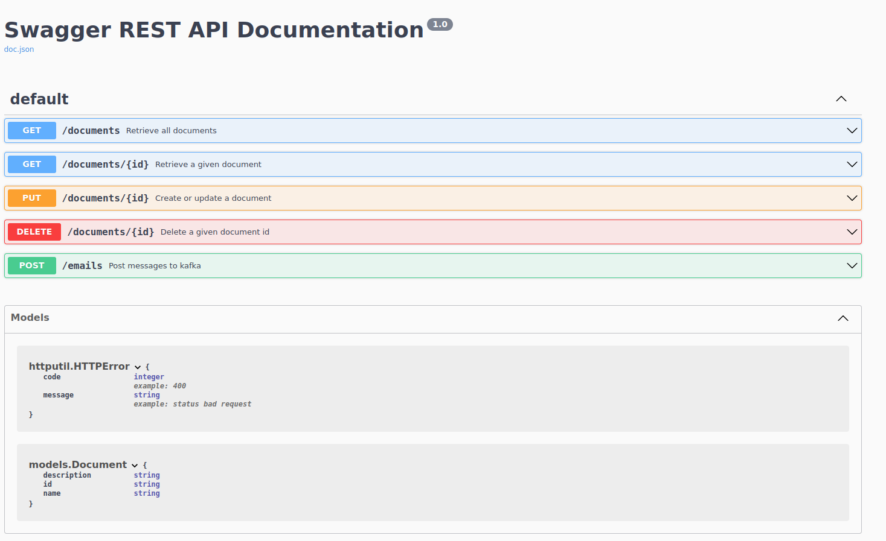

# Simple test application

This is a simple REST API application for demonstrating several use cases.

## Run application in local

`go run main.go`

## Run application in docker

`docker build -t docker-app-test .`

run `docker container run --rm -p 8040:8040  docker-app-test` for using an in memory data source

or run `docker-compose up` for using mongodb as datastore
(you may need to create a docker network with `docker network create network-go-ref-api--subnet 172.24.29.0/29` for example)

## Access to swagger api documentation

The documentation is accessible at : http://localhost:8040/swagger/index.html

## Generate swagger documentation

Thanks to the swaggo module, one can annotate the endpoints and generate swagger documentation with:

`swag init  --output docs/apis --parseInternal --parseDependency`

## Description 

The configuration file is config.yml.

There are serveral packages : 

### <u>database package</u>

This package contains code relative to the use of a mongodb datastore
By default, the application runs with an in memory data source.
However, one can run docker-compose in order to run a mongo db server. 
The mongo datastore will then be used by the app (thanks to an environment variable set in docker-compose.yml)

### <u>docs</u>

This package has been generated by swaggo

### <u>goconvey</u>

Here is an example how to use goconvey for tests. There are behavior tests. Here there ayre meant to run against a running server
for testing the apis with a mongodb server.

To run the behavior test, launch docker-compose , then

`go test -v ./goconvey`

running goconvey command, you can even check the tests inside the browser at http://localhost:8080

### <u>kafka</u>

This package demonstrates the use of kafka for posting messages and consuming them
There is a kafka producer that will be used by the email resource and a kafka consumer that will send an email to
an smtp server (maildev in the docker compose).
The emailSender has the responsability to send it. It closes the connection every 30 seconds if no email was sent during this time range.
(Demonstrates the use of unbuffered channel and mutex)
Running against the docker-compose, one can check the emails sent on the inbox at http://localhost:1080

### <u>repositories</u>

The package for the interface repository and its implementations (inmemory or mongo)

### <u>resources</u>

The package for the resource apis

### <u>services</u>

The package for the service. That's the layer between the resource and the repositories.

## Run tests
go test -v `go list ./... | grep -v goconvey` for running all tests except the ones in package goconvey.

Indeed, they are behavior tests that need to be run against the server api.

To run the behavior test, launch docker-compose , then

`go test -v ./goconvey`

## CI/CD

The pipeline is run under gitlabci and the .gitlabci.yml is its configuration file.
See gitlab/README.md
There is also the .github/go.yml that permit to run the unit tests once the branch is pushed on github.

## Some call examples:

### Add documents
`curl -X PUT --include http://localhost:8040/documents/toto  --header "Content-Type: application/json" --data '{"name":"monnom", "description":"mydesc"}'`
`curl -X PUT --include http://localhost:8040/documents/titi  --header "Content-Type: application/json" --data '{"name":"monnom2", "description":"mydesc2"}'`

### Get all documents
`curl --include http://localhost:8040/documents`

### Get a document given id
`curl --include http://localhost:8040/documents/toto`

### Delete a document given id
`curl -X DELETE --include http://localhost:8040/documents/toto`

### Post emails 
`curl -X POST http://localhost:8040/emails -F "from=no-reply@people-doc.com" -F "to[]=alexis.cothenet@ukg.com" -F "subject=Hello, here is an email" -F "textBody=Here is my body Text"  -F "htmlBody='
Here is my body html
'"  -F "attachments[]=@my_path_to_pdf/file1.pdf" -F "attachments[]=@my_path_to_pdf/file2.pdf"  --header "Content-Type: multipart/form-data" `
